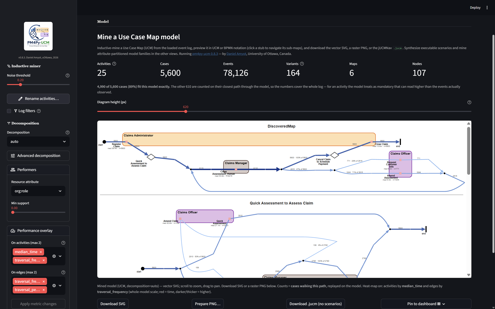
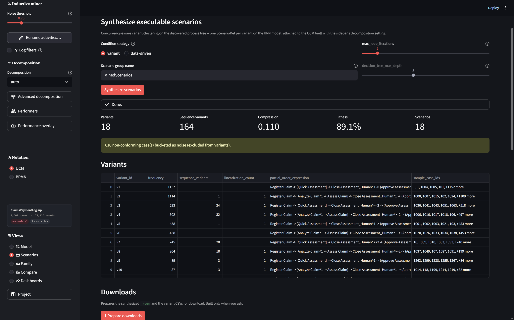
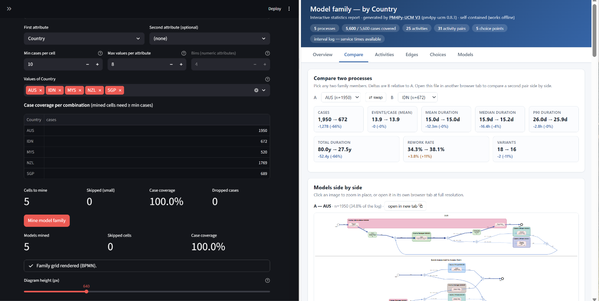
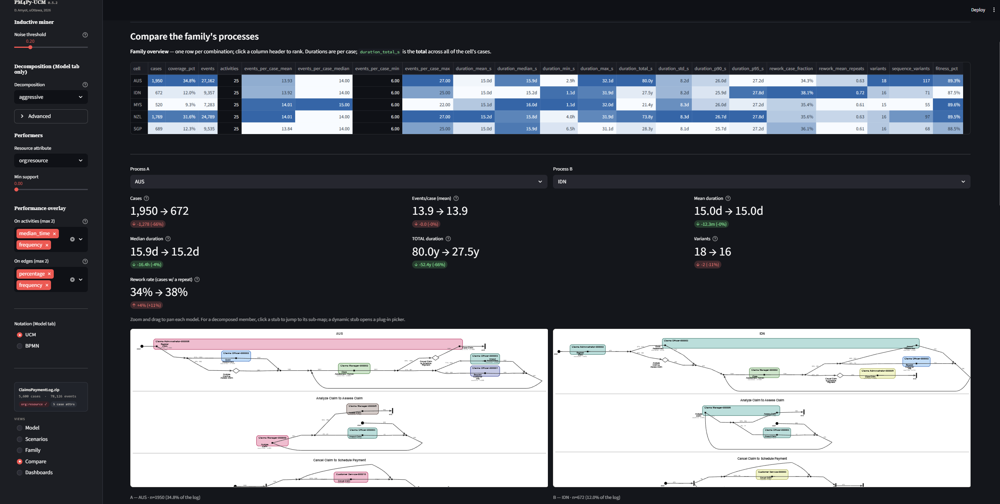
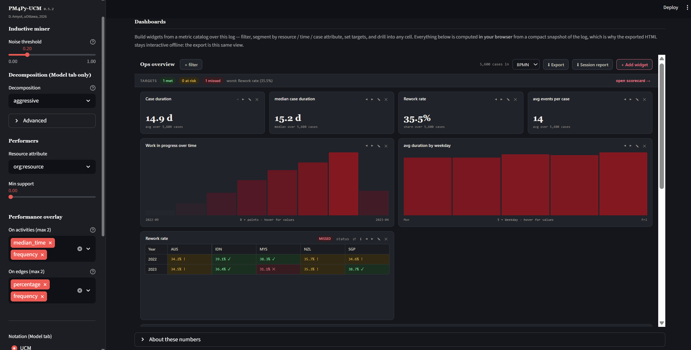

# pm4py-ucm web front-end

A [Streamlit](https://streamlit.io) front-end for the `pm4py-ucm` package.
Upload an event log (XES or CSV) and, from a left-rail workspace, mine and
render **UCM models** (UCM or BPMN notation, PNG and navigable **SVG**),
synthesize executable **scenarios**, mine attribute **model families**,
**compare** family members, and build interactive **dashboards** —
downloading `.jucm`, CSV, SVG/PNG, and self-contained HTML at every step.
A global **pre-mining log filter** (keep activities / trace-variants by
frequency rank, exclude activities, restrict a date window) and **activity
renaming** (relabel / merge activities before mining) apply to every view
and its exports, and the filtered event log is itself downloadable as
**XES + CSV**.

Since v0.7.0 the deployed app is **V5** (the workspace shell + Dashboards,
with a global pre-mining log filter and activity renaming), a strict
superset of the earlier four-tab V3 and workspace V4 apps.

Since v0.7.12 the deployed app is **V6** (`streamlit_app_v6.py`), a superset
of V5 that adds a cost screen ahead of mining — see
[The cost screen (V6)](#the-cost-screen-v6). `streamlit_app.py` shims it, so
the public URL serves it.

## Run locally

Requires Python 3.9+ and the [Graphviz](https://graphviz.org/download/) `dot`
binary on `PATH` (the layouter shells out to it).

From the repo root:

```bash
python -m venv .venv
.venv\Scripts\activate            # Windows
# source .venv/bin/activate       # macOS/Linux

pip install -r web/requirements.txt
streamlit run web/streamlit_app_v6.py     # V6 — the current app
# Every older app is DEPRECATED. They still run — and say so on start-up —
# so older results stay reproducible:
# streamlit run web/streamlit_app_v5.py   # V5 — deprecated
# streamlit run web/streamlit_app_v3.py   # V3 — deprecated
# streamlit run web/streamlit_app_v2.py   # V2 — deprecated
```

Streamlit opens `http://localhost:8501`.

The web-specific deps (`streamlit`, `pm4py`, `scikit-learn`) live in
`web/requirements.txt` so they stay out of the package's own dev workflow
(`pip install -e ".[dev]"`). `scikit-learn` is also a runtime dependency of
the package itself as of 0.7.11; it is needed by the data-driven scenario
condition mining (the option greys out when it is missing).

## The app and its views

**`streamlit_app_v6.py`** (**V6**) is served at
https://pm4py-ucm.streamlit.app/ via the `streamlit_app.py` shim (that
deployment's main file). A left rail switches between five views over the
loaded log:

- **Model** — mine a UCM, preview it in UCM or BPMN notation as a zoom /
  pan **SVG** (click a stub to jump to its plug-in map), and download the
  SVG, a raster PNG, or the `.jucm`. Decomposition is honoured across all
  maps. A global **log filter** (range sliders over the activity- and
  variant-frequency ranks, an exclude list, and a date-range slider) and
  **activity renaming** (relabel / merge activities before mining) apply to
  every view and its exports; the filtered log is downloadable as XES + CSV.

  

- **Scenarios** — concurrency-aware variant clustering + one executable
  jUCMNav `ScenarioDef` per variant. A single **Prepare downloads** button
  builds the `.jucm` (carrying the `<scenarioGroups>`), `variants.csv`,
  `case_variant_map.csv`, and (data-driven mode only) `condition_mining.csv`
  on request. Both variant-driven and data-driven OR-fork encodings are
  exposed.

  

- **Family** — partition the log by 1–2 case attributes and mine one model
  per combination. A single **Prepare downloads** button then builds the
  per-cell zip / combined `.jucm` / dynamic-stub umbrella `.jucm` / grid PNG
  / interactive HTML statistics report — download-only artifacts built only
  when you ask, so mining a family just to browse the grid stays fast.
  (The grid SVG is already vector-quality on screen.)

  

- **Compare** — rank the family members on heat-mapped statistics tables
  (including total case durations) and compare any two side by side:
  models (SVG), per-activity/edge deltas, aligned OR-fork branch shares.

  

- **Dashboards** — build widgets from a metric catalog (KPIs, segmented
  bars and tables), narrow them with filters, set targets and a
  scorecard, write custom metrics in the **ƒ formula language**, and
  export a self-contained interactive HTML dashboard (or a multi-section
  session report).

  

### App versions — everything before V6 is deprecated

V6 is V5 plus the cost screen below and the Scenarios view's Simulation
section. **Every older app is deprecated**: kept runnable so older results
stay reproducible, rendering a notice at the top when you start it, but
receiving no new features. Concretely, they still *save* every session
parameter — each keeps a gather covering the whole registry, so their Save
button works — but only V6 *restores* the newer ones.

| App | File | Status |
|---|---|---|
| **V6** | `streamlit_app_v6.py` | **Current**, and what `streamlit_app.py` shims for https://pm4py-ucm.streamlit.app/ |
| V5 | `streamlit_app_v5.py` | Deprecated. Workspace shell + Dashboards; no cost screen, no Simulation |
| V3 | `streamlit_app_v3.py` | Deprecated. The four-tab app, a strict subset of V5 |
| V2 | `streamlit_app_v2.py` | Deprecated. Model + scenarios; was frozen for a paper, no longer |
| V4 | — | Removed; a strict subset of V5, in git history |
| V1 | — | Removed at v0.5.1 (model only) |

`streamlit_app_v2.py` (model + scenarios) was **frozen** rather than merely
deprecated for as long as a paper under review pointed at
https://pm4py-ucm-scenarios.streamlit.app/: byte-for-byte unchangeable, and
the one app rendering no deprecation notice, because a banner would have
changed what the reviewers saw. That paper has been accepted and its final
version points at the main app, so the freeze is over — V2 is deprecated on
the same terms as the rest.

## The cost screen (V6)

On a log with a large alphabet or near-unique cases the miner can run for
minutes, or not finish. V6 screens the log **before** mining and, when it
looks expensive, stops to say so rather than spending the time silently.

The verdict is a **reason, not an ETA** — the statistics that rank logs
correctly cannot time them. The panel shows activities / cases / events /
variants (as *kept / original* once a filter is on) and what tripped the
screen. Reducing the log is the only remedy that keeps the model usable;
faster miner settings return a flower model with every activity and no
control flow, which leaves nothing to cluster or synthesize from.

### The two one-click reductions

The gate offers the two reductions that address the two conditions it
screens for:

* **Keep the N most frequent variants** — drops rare *behaviour*, keeping
  every activity. Usually the bigger win, because the number of distinct
  sequences drives the cost.
* **Keep the N most frequent activities** — drops rare *activities*; they
  disappear from the model and the alphabet shrinks.

Both apply, in either order, and each re-checks the log afterwards so you
can apply the second before mining. Each appears in the sidebar's **Log
filters** with its own *Remove* button, survives a refresh, and travels in a
saved project.

Each reduction is recorded as **what it selected** — the variant one keeps
the *cases* it picked on the log as it stood when you clicked it, the
activity one names the *activities*. They are deliberately not stored as
"top N by rank", because a rank is relative to a population and every other
filter moves it: re-reading "the top 2,000 variants" after an activity
reduction had collapsed the log to fewer than 2,000 selected all of them,
silently restoring every case the reduction had dropped.

### The replay gate

The model itself is cheap once mined; the replay-based metrics (coverage,
traversal counts) are a second pass that on a big log dominates everything.
Unlike mining, that cost *can* be measured, so V6 probes rather than
guesses. Most logs finish inside the probe and are never interrupted; when
they do not, you are told the estimate and can compute the metrics, drop
them, or defer. Time metrics such as sojourn are read straight from the log
and are computed either way.

Answering the prompt changes only the metrics — the mined model and the log
filters stay exactly as they were.

## Using the app

### 1 · Pick or upload a log

Two tabs at the top of the page:

- **Sample log** — pick one of the bundled XES logs and click **Load
  sample**. This is the quickest way to try the tool when you don't
  have an event log handy. Extending the list is just dropping more
  `.xes` / `.xes.gz` / `.zip` files into [`web/samples/`](samples) —
  the selector picks them up automatically on next deploy / restart.
- **Upload your own** — the file uploader accepts:
  - **`.xes`** / **`.xes.gz`** — standard XES files are mined directly.
  - **`.zip`** — searched for the first `.xes` / `.xes.gz` entry inside.
  - **`.csv`** — a column-mapping section appears after upload (see step 2).
  - Upload cap is **1 GB when running locally** and **75 MB on the
    public Community Cloud deployment**. The server layer allows 1 GB
    everywhere (`.streamlit/config.toml`); the app enforces the tighter
    75 MB when it detects it's running on Community Cloud (via the
    `HOSTNAME` / `/mount/src` fingerprints). Self-hosted deployments
    (Docker on your own VM, an on-prem server, …) get the local 1 GB
    ceiling by default.

Once a log is chosen (from a sample or an upload) its bytes are cached
for the rest of the session. Changing notation / decomposition /
performer settings re-uses the same log, so you never have to re-pick
or re-upload to try a different option.

### 2 · CSV column mapping (CSV uploads only)

When the uploaded file is CSV, five dropdowns appear under **CSV columns**:

| Field | Required? | Notes |
|---|---|---|
| Case id column | ✓ | Trace identifier |
| Activity column | ✓ | Event name |
| Timestamp column | ✓ | Parsed with pandas/`pm4py.format_dataframe` |
| Role column (optional) | — | Renamed to `org:role` for performer mining |
| Resource column (optional) | — | Renamed to `org:resource` for performer mining |

Sensible defaults are auto-detected from common column names
(`case:concept:name`, `concept:name`, `time:timestamp`, `org:role`, `Resource`,
`Assignee`, …). Review them, adjust if needed, then click **Apply column
mapping** to start mining. Mining is *blocked* until this button is clicked
on a fresh upload, so the miner never runs against a wrongly-guessed mapping.

Any column may fill any role — including one already named `concept:name`,
`org:role`, etc. The role/resource columns are mapped to `org:role` /
`org:resource` *before* the log is formatted, so picking a role column that
happens to be named `concept:name` (e.g. a log where the phase sits in
`concept:name` and the activity in another column) maps cleanly instead of
colliding with the canonical activity column.

Changing the dropdowns after the initial Apply shows a yellow banner and a
re-apply button — but mining keeps using the last-applied mapping in the
meantime, so other sidebar settings remain responsive.

### 3 · Sidebar — Options

#### Notation

- **BPMN** (default) — Activity boxes for responsibilities, gateway diamonds
  with `X` / `+` markers, BPMN-canonical start / end events. The notation most
  readers already know, so it is what the app shows out of the box.
- **UCM** — Z.151 / jUCMNav notation. Filled circle for the start
  point, perpendicular bar for the end point, small black square + name for
  each responsibility, synchronisation bars for AND-forks/joins, dots for
  OR-forks/joins, diamond reserved for stubs.

Switching notation re-renders the PNG but does **not** re-run the miner.

#### Inductive miner — Noise threshold

The IMf (*Inductive Miner — infrequent*) threshold. `0.0` keeps every observed
behaviour (classic Inductive Miner, perfect fitness, often noisy diagrams);
higher values filter out increasingly rare arcs and activities, producing
smaller and more abstract models. **0.2 is the default and a sensible
practical starting point**; useful range is roughly 0.1 – 0.4.

#### Decomposition

- **off** (default) — single flat map.
- **auto** — split into a root map plus plug-in maps, with the map size
  **fitted to the mined tree's shape** (`suggest_decomposition`): the
  `max_leaves_per_map` cap scales sub-linearly (≈ 1.5·√N in the tree's
  activity-leaf count N) and the `min_leaves_to_decompose` floor scales with N,
  so a small model stays flat while a large one splits into readable,
  not-too-many maps — no magic numbers.
- **Pre-set: Max=8/Min=4** and **Pre-set: Max=6/Min=3** — pin those fixed
  dimensions instead of fitting them, for when you want a specific granularity.
- **Custom** — set `max_leaves_per_map`, `min_leaves_to_decompose` and
  `balance_ratio` by hand.

All modes decompose on **every** operator kind. Switching to any non-off mode
reveals an **Advanced decomposition** expander with the four toggles
(`on_root_sequence`, `on_parallel`, `on_alternative`, `on_loop`) — all on by
default — if you ever want to exclude one; under **Custom** the size inputs are
editable there, and `auto` / the pre-sets show their values as a caption. Click
**Apply changes** to remine.
See the main `README.md`
[Hierarchical decomposition](../README.md#hierarchical-decomposition)
section for what each key does.

#### Performers

- **Resource attribute** — pick from `org:role` (default), `org:resource`,
  `Other…` (a custom event-attribute name, or a comma-separated fallback
  list like `org:role, org:resource, org:group`), or `(none)` to skip
  performer mining entirely.
- **Min support** — minimum fraction of events for an activity that must
  agree on a performer before the binding is kept. `0.0` (default) accepts
  the modal performer even when the resource pool is highly dispersed;
  raise this if you want only majority-owned activities to be bound.
  Disabled when performer mining is off.

The sidebar settings above (notation, miner, decomposition, performers)
apply to every view. Pick a view in the left rail:

### 4 · Model

**Log filters (optional).** Tick **Filter the event log** in the sidebar
(under **Log filters**) to pre-filter the log before mining, using two-handled
**range sliders** so you can keep the most frequent, the least frequent, or a
middle band:

- **Activities by frequency rank** — keep activities whose rank falls in the
  selected band (rank 1 = most frequent); plus an **Exclude activities** list.
- **Attribute filter (ƒ)** — a one-line predicate over case attributes, using
  the **same ƒ grammar as a custom dashboard metric**: keep the cases it
  evaluates true for. Categorical: `attr("Channel") == "Web"` (or `!=`, OR-ed
  for a set — `attr("Channel") == "Web" or attr("Channel") == "Phone"`).
  Numeric / temporal: `attr("amount") > 500 and duration() < 30`, also
  `count("Act")`, `contains("Act")`, `time_between(a, b)`, and `and` / `or` /
  `not`. The detected attribute names are listed under the box; an invalid
  expression shows an inline error and is ignored until fixed.
- **Variants by frequency rank** — keep trace variants in the selected band,
  with a **top variants by case coverage %** box synced to the slider.
- **Date range** — a slider over the log's own span (fewer clicks than two
  calendars), with a **cases in the window** choice (*intersecting* or *fully
  inside*).
- **Cycle-time percentile (case duration)** — a two-handled band over each
  case's **end-to-end cycle time** (last − first event): `0` = fastest,
  `100` = slowest. Keep the fastest cases (drag the left handle in), the slowest
  (drag the right handle in), or a middle band — e.g. `0–10` keeps the fastest
  10% of cases, `90–100` the slowest 10%. (Shown only when the log has a real
  time span.)

Each is a standard pm4py log filter applied before inductive mining. The
filter is **global** — every view (Model, Scenarios, Family, Compare,
Dashboards) and every export works over the same filtered log — so changing a
filter re-mines. The Model view's Activities, Cases, and Events metrics then
read **selected / total**, and the filtered log is itself downloadable as
**XES + CSV**. Alongside the filter, **activity renaming** is a real
pre-mining transform: relabel or merge activities (edited in a modal dialog
with an **Apply** button, seeded from a CSV / JSON map and exportable as JSON)
before the miner runs, again applying to every view and export.

Once mining completes, the **Model** view shows a metrics row (activities,
cases and events — selected/total when filtered — plus maps and nodes) and
the diagram as a **vector SVG** in a zoom / pan viewer — scroll to zoom, drag to pan, and for a
decomposed model **click a stub** to jump to its plug-in map (a dynamic
stub opens a picker of its preconditioned plug-ins), and click a plug-in
map's **end point to jump back to its parent** — navigation runs both ways.
Downloads:

- **Download SVG** — the vector render (crisp at any zoom, text
  selectable).
- **Prepare PNG…** → **Download PNG** — a raster render, generated on
  demand.
- **Download .jucm** — the model in jUCMNav's native XMI format, ready to
  open in [jUCMNav](https://github.com/JUCMNAV/jUCMNavPlus).
- **Pin to dashboard** — adds the live model as a widget in the Dashboards
  view. The pinned widget is itself a zoom / pan viewer — scroll to zoom,
  drag to pan, click a stub to jump to its sub-map — not a flat image.

**Performance overlay & heat-map.** The sidebar's **Performance overlay** group
annotates the model with up to two activity metrics and two edge metrics
(traversal counts, frequency, coverage, service / waiting / sojourn times, an
OR-fork branch's share …) — shown as a small gray sub-line and written to the
`.jucm` as jUCMNav metadata. Because changing a metric re-annotates the model,
the pickers stage behind an **Apply metric changes** button.

*Which count?* The defaults are `traversal_frequency` /
`traversal_percentage`, which count how often the log **walks the model** —
computed by replaying the log on the mined process tree. They are the ones
that **add up**: an activity's count equals the count on its own incoming and
outgoing edges, every branch of a parallel fork carries the fork's inflow, and
a choice's branches sum to it. The older `frequency` counts events
(activities) and *directly-follows pairs* (edges) — how often two activities
were **adjacent in a trace**. That is a different measurement, and on a model
with parallel branches or silently skipped ones it is much smaller than the
real flow: the event that follows an activity is usually one from a sibling
branch, and a silent skip produces no pair at all (which is how a branch can
report a bare "100 %"). Both remain available; the diagram caption always says
which is in use, and a share is shown with the base it divides ("25 % of 258").

*How much of the log does this describe?* Under the metrics row the Model view
reports how many cases fit the model exactly — e.g. "4,990 of 5,600 cases
(89 %)". A model mined with a **noise threshold** deliberately drops
infrequent behaviour, so it explains only part of its log; the remaining cases
are counted on their closest path through the model, so the numbers still
cover everything (for an activity the model treats as mandatory that can read
higher than the events actually observed). Below 70 % the note becomes a
warning suggesting a lower noise threshold — `0.0` explains every case, at the
cost of a busier model. See [`docs/metrics.md` §9](../docs/metrics.md).

*Too slow?* The traversal counts are the only ones that need the log replayed
on the model, and on a log with thousands of distinct variants that replay is
the longest step of a mine — minutes. Because a run cannot be interrupted once
it starts, the choice is made up front: untick **Replay the log for traversal
counts** and the traversal metrics fall back to their event-based counterparts
(`traversal_frequency` → `frequency`, `traversal_percentage` → `percentage`),
which are cheap but do not conserve. It is a straight trade of accuracy for
time — the counts are never estimated from a half-finished replay, since that
would bias them while still looking exact. Your metric picks are untouched, so
ticking the box again restores the conserving counts, and **both the picks and
the opt-out are saved with a project** and with the exported Python script
(as `OVERLAY_REPLAY`, which you can flip back on in the script).

Tick **Heat-map emphasis** to
additionally colour and thicken activities and edges by the value of the
**first** metric of each layer: a **time** metric drives a **red** ramp, any
other a **blue** one, with lighter/thinner = lower and darker/thicker = higher.
The heat-map applies across the **Model, Family and Compare** views. The
**Heat-map scale** is three-way: **Local (per map)** (each diagram on its own min/max —
every sub-map shows its own hotspots), **Per family member (across its maps)** (every map on the whole
model's min/max, so a value reads the same everywhere; coincides with local when
the model isn't decomposed), and **Global (across family members)** (every cell of the Family /
Compare views on **one shared range**, so a colour is comparable across members
— it falls back to whole model in the single-model Model view). In BPMN the
activity box is tinted under a stronger,
thickened contour; in UCM the responsibility marker itself colours and grows
with the value. A path keeps one colour and thickness across its routing points
(empty points) up to the next real node. It is a render-time overlay — the SVG
and PNG match it, and the `.jucm` is unchanged. The heat-map's on/off and scale
travel with a saved project (see below).

### 5 · Scenarios

Choose a **condition strategy** — *variant-driven* (lossless; every OR-fork
guarded by `variant_id == v_i`) or *data-driven* (a decision tree per
outside-loop fork turns case attributes into a business-readable rule;
needs `scikit-learn`) — and a scenario-group name. The view reports
headline metrics (variant count, sequence variants, compression, fitness,
and per-fork condition-mining accuracy in data-driven mode). A single
**⬇ Prepare downloads** button then builds the `.jucm` (with the synthesized
`<scenarioGroups>`), `variants.csv`, `case_variant_map.csv`, and
(data-driven) `condition_mining.csv` — the `.jucm` is serialized only when
you ask, since this view shows no model on screen. Works on flat and
decomposed models alike.

#### Simulation (bottom of the Scenarios view)

Once scenarios are synthesised, the section at the bottom of this view runs
each one the way jUCMNav does — a token per enabled start point, an OR-fork
picking the branch whose guard holds, an AND-fork spawning a token per arm,
an AND-join waiting for every one — and reports the same problem kinds
jUCMNav lists in its Problems view. A decomposed model is traversed into its
plug-in maps, so a stub is descended rather than skipped.

Two highlight modes over the mined model:

* **Coverage** — pick any number of scenarios; what they walked is
  coloured, and the numbers are reported as **Elements** (path nodes: start
  and end points, responsibilities, forks and joins, stubs) and **Paths**
  (the segments between them), against the **whole model**. The split
  matters: a run can walk every node and still miss segments, so elements at
  100% with paths below it means what is left over is empty alternatives
  rather than unexercised behaviour. A breakdown per element kind is one
  click away. Coverage is a set, so a loop that enters an element nine times
  covers it once, and a single scenario reads low by design — it walks one
  path through a model containing every path.
* **Compare A vs B** — pick two scenarios; what only **A** walked is dark
  green, only **B** dark orange, and what **both** walked purple, with the
  three counts, an agreement figure, and how many elements neither touched.
  The pair differs in lightness as well as hue, so it survives a greyscale
  printout.

Every element carries hover text saying what it is and whether these
scenarios walked it. The performance overlay's heat-map is suspended while a
highlight is on — both colour the same elements, so only one can be read at
a time — and the app says so rather than letting it appear to vanish.

The mode and the selected scenarios are part of the session: a saved project
resumes into the same highlight, and an exported script reproduces it (§9).
Scenarios are remembered by **name**, so if you re-mine at a different noise
threshold and a scenario is gone, the selection falls back to the defaults
instead of quietly highlighting a different one.

### 6 · Family

A **💡 Suggested attributes** table ranks the case attributes by
**discriminative power** — how much the process actually changes across each
attribute's values (control-flow divergence + case-duration effect, discounting
identifiers and near-constant fields) — so the picker isn't a blind guess. It is
fully **deterministic** (no LLM; `pm4py_ucm.rank_partition_attributes`); when
nothing scores high it says so, rather than pretend.

Pick **1–2 case attributes**; a **coverage heatmap** previews the cell
sizes *before* mining, with per-value filters, a `min_cases` floor, and
quantile `bins` for numeric attributes. Mine to get one model per
combination, shown as a **2-D SVG grid** (rows × columns). A single
**⬇ Prepare downloads** button then builds the download-only artifacts —
the per-cell `.zip`, the combined `.jucm` (shared definitions), the
dynamic-stub **umbrella** `.jucm` (one plug-in per variation point, with
executable strategies), the grid **PNG**, and the self-contained
**interactive HTML statistics report** — plus the umbrella's variation-point
counts. They are built only when you ask, so mining a family just to browse
the grid stays fast; the grid **SVG** is already on screen.

### 7 · Compare

Rank the family members on a heat-mapped statistics table (per-cell cases,
durations incl. **total**, events/case, variants, rework), then pick any
two and see them **side by side**: SVG models, delta cards, per-activity
and per-edge Δ tables, and aligned OR-fork branch shares.

### 8 · Dashboards

An embedded, self-contained dashboard island over the log's per-case
**fact table** — and the *same artifact* the HTML export writes, so what
you build on screen is exactly what you ship.

**Build a widget.** Pick a metric from the catalog (or write your own in
the **ƒ formula language** — `duration() where attr("Claim_Value") > 500`,
full grammar below), choose an **aggregation**, add per-widget or
dashboard-level **filters** (including a **date range**), and **segment**
by up to two axes. A live preview draws the real widget as you compose it.

**Choose a shape.** The Chart row offers thumbnails of the visualisations
that say something true about what you picked:

| Segmentation | Shapes offered |
| --- | --- |
| no axes | **KPI card**, **histogram** or **box plot** (the distribution) — plus a **gauge** when the widget has a target |
| one axis | **bar**; a **line** on a time axis; a **pie / donut** when the aggregation is a `sum` |
| two axes | a **heatmap table** |

**Targets and the scorecard.** Set a target and watch the **scorecard**. A
segmented target rolls up to one state — so its row **expands to the
segments that breached it**, and clicking one filters the whole dashboard
to that segment.

**Arrange.** Drag a widget's grip to reorder it, drag its corner to
resize; the layout is remembered.

**Several dashboards.** A log can hold several **named dashboards** —
switch from the header dropdown (New / Rename / Delete). Each keeps its
own widgets and filters.

**Take it with you.**

- **⬇ Export** — this dashboard as one self-contained interactive HTML
  file: offline, no server, still filterable.
- **⬇ Export all** — every dashboard in one file, switchable, read-only.
- **⬇ Session report** — a multi-section report (scorecard + dashboards +
  the model as SVG + a Family section).
- **⬇ Save / ⬆ Load** — the dashboard's *definition* (widgets + filters)
  as a small reusable JSON, reloadable here or on **another log**; widgets
  naming activities or attributes the target log lacks are reported up
  front rather than shown as misleading zeros.

The exact metric definitions and the engine's rounding / weighting
decisions are documented in [`docs/dashboards.md`](../docs/dashboards.md);
a runnable walkthrough is
[`demo/dashboards_tutorial.ipynb`](../demo/dashboards_tutorial.ipynb).

#### The ƒ custom-formula language

When the catalog doesn't name what you want to measure, write it as a
**custom formula**: a per-case expression, optionally narrowed by a
`where` clause, that the dashboard then aggregates (avg / median / share /
…) exactly like any built-in metric. Choose **ƒ Custom formula…** in the
widget composer's metric list; a live chip validates as you type and shows
the inferred result type, and function chips insert the calls below.

**Functions** — each returns one number per case:

| Function | Returns |
| --- | --- |
| `duration()` | case length, in days |
| `contains("act")` | `1` if the case contains activity *act*, else `0` |
| `count("act")` | how many times *act* occurs in the case |
| `time_between("a", "b")` | days from the first *a* to the first *b* after it; null if that never happens |
| `timestamp("act")` | epoch seconds of the first *act*; null if absent |
| `attr("name")` | a **numeric** case attribute; null if absent or non-numeric |

**Operators**, from lowest to highest precedence: the trailing `where` <
`or` < `and` < `not` < comparisons (`==` `!=` `>` `>=` `<` `<=`) < `+` `-`
< `*` `/` < unary `-`. Group with `(` … `)`. A comparison or a logical
yields `1` / `0`, so it reads as a percentage after aggregation.

**`where`** — a trailing `where <predicate>` keeps only the cases the
predicate holds for and sets the rest to null (which aggregation drops), so
`duration() where contains("Appeal")` measures duration over appealed
cases only.

**Grammar** (EBNF):

```ebnf
formula    := orExpr [ "where" orExpr ]
orExpr     := andExpr ( "or" andExpr )*
andExpr    := notExpr ( "and" notExpr )*
notExpr    := "not" notExpr | comparison
comparison := additive ( ("=="|"!="|">"|">="|"<"|"<=") additive )?
additive   := term ( ("+"|"-") term )*
term       := unary ( ("*"|"/") unary )*
unary      := "-" unary | primary
primary    := number | call | "(" orExpr ")"
call       := IDENT "(" [ arg ( "," arg )* ] ")"
```

**Examples**:

| Formula | Measures |
| --- | --- |
| `duration() where attr("Claim_Value") > 500` | case duration, over claims above 500 |
| `contains("Appeal")` | share of cases that were appealed → *percent* |
| `count("Rework") / count("Assess")` | rework ratio per case |
| `time_between("Register", "Pay") where attr("Claim_Value") > 1000` | register → pay days, high-value claims only |

**One value type, and no `eval`.** Every expression evaluates, per case, to
a **number or null** — there are no strings at runtime; a string only ever
*names* an activity or attribute inside a call, fixed when the formula is
written. The text is parsed to an explicit syntax tree and never handed to
a language `eval`, so the only operations are the ones above, over the only
data the fact table holds — nothing you type can reach the host. `null` (a
missing time, an absent attribute) propagates through arithmetic and
comparison and is dropped by aggregation. Categorical attributes aren't
values here — filter them with the widget's **Filter** row; that is what
keeps the grammar single-typed and identical between the Python evaluator
and the in-browser one.

**Result type** is inferred from the expression and picks the unit and the
aggregations offered: a comparison, a logical, or a bare `contains()` is a
0/1 indicator → **percent** (aggregate with *share*); anything mentioning a
time function → **time**; otherwise → **count** — exactly as a catalog
metric's type does.

The canonical specification is the module docstring of
[`formula.py`](../pm4py_ucm/algo/dashboards/formula.py); see
[`docs/dashboards.md`](../docs/dashboards.md) for how it fits the rest of
the engine.

### 9 · Save, share & resume a project

The whole session is a project you can put down and pick back up, or hand to
a colleague. The sidebar's **Project** group offers two saves:

- **⬇ Save settings** → `<log>.ucmproj.json` — the *configuration only* (miner
  settings, CSV mapping, renaming, filters, performers, overlays,
  decomposition, family and scenario settings, the Simulation highlight, the
  open view, and your dashboards). Small and email-able; carries **no event data**, so it's the
  privacy-preserving way to share when the log is sensitive.
- **⬇ Save project bundle** → `<log>.ucmproj.zip` — everything above **plus the
  event log**, so it is self-contained and one-click to resume (it does ship
  the data).

Resume either from **↻ Resume a saved project** in the log-source area: a
bundle brings its own log; a settings file re-uses the loaded log or asks you
to re-supply it (matched by hash, with a warning on a mismatch). Only *inputs*
are stored — the model, scenarios, family, reports and dashboards **recompute**
on load, so project files stay tiny and never go stale against a change in how
a model is mined. Dashboards travel through a small versioned bridge that reads
the browser-island widgets back on save and restores them on resume; the Family
tab re-mines automatically the first time you open it after a load, and Compare
follows. The design and its future-proofing (a single parameter registry, CI
drift guards on both the save **and** restore sides, versioned schema) are
documented in [`docs/sessions.md`](../docs/sessions.md), and
[`demo/sessions_tutorial.ipynb`](../demo/sessions_tutorial.ipynb) is a runnable
walkthrough of the underlying `web/sessions` API.

The **Project** group also has a single **⬇ Export Python (.py + .ipynb)**
download — a zip with the current session emitted **both** as a runnable script
and as a notebook, over the public `pm4py_ucm` API: log loading, the pre-mining
rename + filters (including the cycle-time band), mining, decomposition,
performers, the performance overlay and the model export, with check-boxes to add
the **scenario-synthesis**, **model-family** and **dashboards** pipelines (all
pre-selected). The script writes each image as both `.png` and vector `.svg`, all
carrying the **performance heat-map**; the dashboards go into one self-contained
interactive HTML file with a read-only switcher (a pinned-model widget embeds the
mined model as SVG). The `.ipynb` is laid out as a **tutorial** — each stage
defines its function, runs it, and shows the result inline (the loaded log, the
case counts, the mined model and family grid as **SVG**, the variants table, the
live dashboards). The scenario step pins the same noise-thresholded tree the app
clusters on, so its variant count matches the Scenarios view, and it is
followed by a **simulation** step that replays those scenarios and writes
`simulation.svg` — the highlight the app was showing — plus a coverage or
A/B summary CSV. Because a project
stores only *inputs*, both are a faithful, deterministic replay (no LLM — a
template emitter). It's the way to take a GUI exploration to an automatable,
version-controllable pipeline; see [`docs/code_export.md`](../docs/code_export.md).

## Deploy to Streamlit Community Cloud

1. Push this repo to GitHub.
2. At <https://share.streamlit.io>, "New app" → pick the repo and branch.
3. Set **Main file path** to `web/streamlit_app_v6.py`. Streamlit Cloud
   picks up `web/requirements.txt` automatically (it sits next to the
   main file). The existing primary deployment points at
   `web/streamlit_app.py` — a shim that runs V6 — so it keeps working
   without a settings change. Pointing a deployment at one of the
   deprecated apps still works, but it will render their deprecation
   notice to every visitor.
4. **`packages.txt` (apt packages) MUST be at the repo root** — Streamlit
   Cloud's apt-install phase only reads from the root, not from the main
   file's directory. The root `packages.txt` in this repo installs the
   `graphviz` apt package, which provides the `dot` binary the layouter
   shells out to.
5. Deploy.

Updates are a `git push` to the tracked branch.

## Adding more sample logs

The **Sample log** tab is populated by scanning
[`web/samples/`](samples) for `.xes`, `.xes.gz`, and `.zip` files.
Drop a new file in there and it shows up on the next app start — no
code change. Display names are derived from the file name (underscores
become spaces, archive/compression suffixes stripped).

## Robustness & security notes

The app is designed for a low-traffic public demo (Streamlit Community
Cloud or similar). A few hardening points worth knowing:

- Upload cap is **two-tier**. The Streamlit server layer
  ([`.streamlit/config.toml`](../.streamlit/config.toml)) allows
  **1 GB** everywhere, so the file uploader itself never blocks a
  local run. The app then re-checks the payload size and rejects
  anything above **75 MB** *only when it detects it is running on
  Streamlit Community Cloud* (via the `HOSTNAME` / `/mount/src`
  fingerprints). Result: 1 GB locally, 75 MB on the public demo,
  self-hosted deployments default to the local ceiling.
- The Pillow decompression-bomb guard is raised to **1 billion pixels**
  rather than disabled. Realistic mined UCMs are far below that.
- CSV reading uses `low_memory=False` so columns with mid-file dtype
  changes don't trigger `DtypeWarning` or downstream type confusion.
- ZIP archives (sample logs and user uploads) are scanned defensively —
  entries with `..` or absolute paths are skipped to prevent
  zip-slip-style path traversal.
- Downloaded file names are sanitised (only `[A-Za-z0-9._-]` survives).
- Mining failures show a one-line error inline plus an expandable
  technical-details panel — no raw Python traceback is displayed by
  default to casual visitors.
- Large logs (e.g. 100k+ events) can take a couple of minutes in the
  inductive miner; a multi-phase status panel reports the current step
  so the page never looks hung. The mining function is wrapped in
  `st.cache_data` keyed on the log bytes + settings, so toggling
  notation / re-mining identical inputs is instant.

If you deploy publicly and care deeply about XML safety, also review
PM4Py's XES parser — it relies on `lxml` under the hood; XXE / billion-
laughs hardening upstream is the right place for those concerns rather
than this Streamlit layer.

## Layout

```
packages.txt                   # apt: graphviz  (Streamlit Cloud reads this at repo root)
.streamlit/
  config.toml                  # upload-size cap, telemetry off
web/
  streamlit_app.py             # entry point (shims V6 — the deployed app)
  streamlit_app_v5.py          # V5 — DEPRECATED (workspace shell + Dashboards)
  streamlit_app_v6.py          # V6 — the current app (adds cost screen + Simulation)
  requirements.txt             # streamlit + pm4py + `-e .` (the package itself)
  PM4Py-UCM-Model.png          # per-feature screenshots used in the READMEs
  PM4Py-UCM-Scenarios.png
  PM4Py-UCM-Family.png
  PM4Py-UCM-Compare.png
  PM4Py-UCM-Dashboard.png
  README.md                    # this file
  samples/
    *.zip / *.xes / *.xes.gz   # bundled sample logs; auto-listed in the UI
```

`-e .` is a relative path resolved against pip's working directory, which is
the repo root both locally (`pip install -r web/requirements.txt` run from
the repo root) and on Streamlit Cloud. Either way it points at the
`pm4py-ucm` project, so any change to the library is picked up on the next
Streamlit rerun (locally) or next deploy (on the Cloud).
