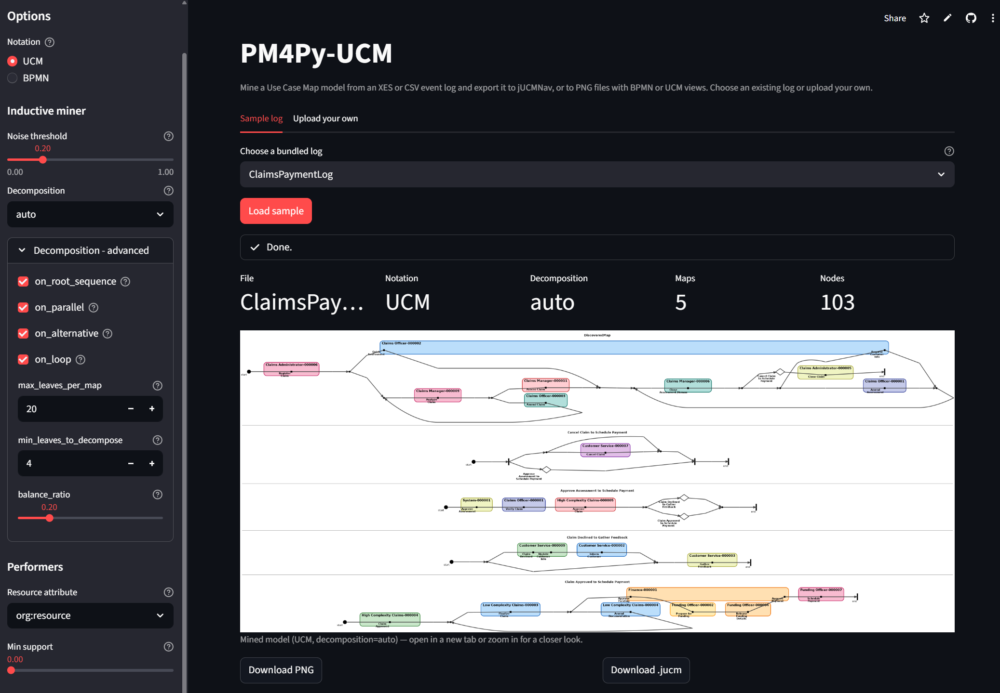

# pm4py-ucm web front-end

A [Streamlit](https://streamlit.io) front-end for the `pm4py-ucm` package.
Upload an event log (XES or CSV), tune the inductive miner / decomposition /
performer settings interactively, and download the resulting `.jucm` model
plus a high-quality PNG rendering in either UCM (Z.151 / jUCMNav) or BPMN
notation.



## Run locally

Requires Python 3.9+ and the [Graphviz](https://graphviz.org/download/) `dot`
binary on `PATH` (the layouter shells out to it).

From the repo root:

```bash
python -m venv .venv
.venv\Scripts\activate            # Windows
# source .venv/bin/activate       # macOS/Linux

pip install -r web/requirements.txt
streamlit run web/streamlit_app.py        # V1 (model only)
streamlit run web/streamlit_app_v2.py     # V2 (model + scenarios)
```

Streamlit opens `http://localhost:8501`.

The web-specific deps (`streamlit`, `pm4py`, `scikit-learn`) live in
`web/requirements.txt` so they stay out of the package's own dev workflow
(`pip install -e ".[dev]"`). `scikit-learn` is only needed by V2's
data-driven scenario condition mining; V1 ignores it.

## V1 vs V2

- **V1** (`streamlit_app.py`) — mine a UCM from a log, preview in UCM or
  BPMN notation, download PNG + `.jucm`. Stable, deployed.
- **V2** (`streamlit_app_v2.py`) — superset of V1. Adds a **Scenarios**
  tab that runs concurrency-aware variant clustering and synthesizes one
  executable jUCMNav `ScenarioDef` per variant, with downloads for the
  `.jucm` (now carrying the `<scenarioGroups>`), `variants.csv`,
  `case_variant_map.csv`, and (data-driven mode only)
  `condition_mining.csv`. Both variant-driven and data-driven OR-fork
  encodings are exposed; the data-driven option greys out when
  `scikit-learn` is missing. The Scenarios tab always runs with
  `decomposition=None` so OR-forks in every XOR receive a `variant_id`
  condition — XORs pushed into plug-in maps would otherwise lose them.

## Using the app

### 1 · Pick or upload a log

Two tabs at the top of the page:

- **Sample log** — pick one of the bundled XES logs and click **Load
  sample**. This is the quickest way to try the tool when you don't
  have an event log handy. Extending the list is just dropping more
  `.xes` / `.xes.gz` / `.zip` files into [`web/samples/`](samples) —
  the selector picks them up automatically on next deploy / restart.
- **Upload your own** — the file uploader accepts:
  - **`.xes`** / **`.xes.gz`** — standard XES files are mined directly.
  - **`.zip`** — searched for the first `.xes` / `.xes.gz` entry inside.
  - **`.csv`** — a column-mapping section appears after upload (see step 2).
  - Upload cap is **1 GB when running locally** and **75 MB on the
    public Community Cloud deployment**. The server layer allows 1 GB
    everywhere (`.streamlit/config.toml`); the app enforces the tighter
    75 MB when it detects it's running on Community Cloud (via the
    `HOSTNAME` / `/mount/src` fingerprints). Self-hosted deployments
    (Docker on your own VM, an on-prem server, …) get the local 1 GB
    ceiling by default.

Once a log is chosen (from a sample or an upload) its bytes are cached
for the rest of the session. Changing notation / decomposition /
performer settings re-uses the same log, so you never have to re-pick
or re-upload to try a different option.

### 2 · CSV column mapping (CSV uploads only)

When the uploaded file is CSV, five dropdowns appear under **CSV columns**:

| Field | Required? | Notes |
|---|---|---|
| Case id column | ✓ | Trace identifier |
| Activity column | ✓ | Event name |
| Timestamp column | ✓ | Parsed with pandas/`pm4py.format_dataframe` |
| Role column (optional) | — | Renamed to `org:role` for performer mining |
| Resource column (optional) | — | Renamed to `org:resource` for performer mining |

Sensible defaults are auto-detected from common column names
(`case:concept:name`, `concept:name`, `time:timestamp`, `org:role`, `Resource`,
`Assignee`, …). Review them, adjust if needed, then click **Apply column
mapping** to start mining. Mining is *blocked* until this button is clicked
on a fresh upload, so the miner never runs against a wrongly-guessed mapping.

Changing the dropdowns after the initial Apply shows a yellow banner and a
re-apply button — but mining keeps using the last-applied mapping in the
meantime, so other sidebar settings remain responsive.

### 3 · Sidebar — Options

#### Notation

- **UCM** (default) — Z.151 / jUCMNav notation. Filled circle for the start
  point, perpendicular bar for the end point, small black square + name for
  each responsibility, synchronisation bars for AND-forks/joins, dots for
  OR-forks/joins, diamond reserved for stubs.
- **BPMN** — Activity boxes for responsibilities, gateway diamonds with
  `X` / `+` markers, BPMN-canonical start / end events.

Switching notation re-renders the PNG but does **not** re-run the miner.

#### Inductive miner — Noise threshold

The IMf (*Inductive Miner — infrequent*) threshold. `0.0` keeps every observed
behaviour (classic Inductive Miner, perfect fitness, often noisy diagrams);
higher values filter out increasingly rare arcs and activities, producing
smaller and more abstract models. **0.2 is the default and a sensible
practical starting point**; useful range is roughly 0.1 – 0.4.

#### Decomposition

- **off** (default) — single flat map.
- **auto** — split into a root map plus plug-in maps when the model is large
  enough to benefit.
- **aggressive** — same boundary rules with a tighter cap, producing more /
  smaller plug-ins.

Switching the preset reveals an **Advanced** expander with six override
knobs (`on_root_sequence`, `on_parallel`, `on_loop`, `max_leaves_per_map`,
`min_leaves_to_decompose`, `balance_ratio`). The widget values are seeded
from the preset; tweak as many as you like and click **Apply changes** to
remine — single click, single remine. See the main `README.md`
[Hierarchical decomposition](../README.md#hierarchical-decomposition)
section for what each key does.

#### Performers

- **Resource attribute** — pick from `org:role` (default), `org:resource`,
  `Other…` (a custom event-attribute name, or a comma-separated fallback
  list like `org:role, org:resource, org:group`), or `(none)` to skip
  performer mining entirely.
- **Min support** — minimum fraction of events for an activity that must
  agree on a performer before the binding is kept. `0.0` (default) accepts
  the modal performer even when the resource pool is highly dispersed;
  raise this if you want only majority-owned activities to be bound.
  Disabled when performer mining is off.

### 4 · Results

Once mining completes, the page shows:

- A **metrics row** — file name, notation, decomposition mode, number of
  maps, number of nodes.
- The **rendered diagram** as an inline `` element. The browser
  scales the preview to fit the column width; right-click → **Open image
  in new tab** to see the file at native resolution, or scroll-zoom the
  page to magnify in place.
- Two **download buttons**:
  - **Download PNG** — the rendered image at full resolution.
  - **Download .jucm** — the model in jUCMNav's native XMI format,
    ready to open in [jUCMNav](https://github.com/JUCMNAV/projetseg-update).

## Deploy to Streamlit Community Cloud

1. Push this repo to GitHub.
2. At <https://share.streamlit.io>, "New app" → pick the repo and branch.
3. Set **Main file path** to `web/streamlit_app.py`. Streamlit Cloud picks up
   `web/requirements.txt` automatically (sits next to the main file).
4. **`packages.txt` (apt packages) MUST be at the repo root** — Streamlit
   Cloud's apt-install phase only reads from the root, not from the main
   file's directory. The root `packages.txt` in this repo installs the
   `graphviz` apt package, which provides the `dot` binary the layouter
   shells out to.
5. Deploy.

Updates are a `git push` to the tracked branch.

## Adding more sample logs

The **Sample log** tab is populated by scanning
[`web/samples/`](samples) for `.xes`, `.xes.gz`, and `.zip` files.
Drop a new file in there and it shows up on the next app start — no
code change. Display names are derived from the file name (underscores
become spaces, archive/compression suffixes stripped).

## Robustness & security notes

The app is designed for a low-traffic public demo (Streamlit Community
Cloud or similar). A few hardening points worth knowing:

- Upload cap is **two-tier**. The Streamlit server layer
  ([`.streamlit/config.toml`](../.streamlit/config.toml)) allows
  **1 GB** everywhere, so the file uploader itself never blocks a
  local run. The app then re-checks the payload size and rejects
  anything above **75 MB** *only when it detects it is running on
  Streamlit Community Cloud* (via the `HOSTNAME` / `/mount/src`
  fingerprints). Result: 1 GB locally, 75 MB on the public demo,
  self-hosted deployments default to the local ceiling.
- The Pillow decompression-bomb guard is raised to **1 billion pixels**
  rather than disabled. Realistic mined UCMs are far below that.
- CSV reading uses `low_memory=False` so columns with mid-file dtype
  changes don't trigger `DtypeWarning` or downstream type confusion.
- ZIP archives (sample logs and user uploads) are scanned defensively —
  entries with `..` or absolute paths are skipped to prevent
  zip-slip-style path traversal.
- Downloaded file names are sanitised (only `[A-Za-z0-9._-]` survives).
- Mining failures show a one-line error inline plus an expandable
  technical-details panel — no raw Python traceback is displayed by
  default to casual visitors.
- Large logs (e.g. 100k+ events) can take a couple of minutes in the
  inductive miner; a multi-phase status panel reports the current step
  so the page never looks hung. The mining function is wrapped in
  `st.cache_data` keyed on the log bytes + settings, so toggling
  notation / re-mining identical inputs is instant.

If you deploy publicly and care deeply about XML safety, also review
PM4Py's XES parser — it relies on `lxml` under the hood; XXE / billion-
laughs hardening upstream is the right place for those concerns rather
than this Streamlit layer.

## Layout

```
packages.txt                   # apt: graphviz  (Streamlit Cloud reads this at repo root)
.streamlit/
  config.toml                  # upload-size cap, telemetry off
web/
  streamlit_app.py             # entry point
  requirements.txt             # streamlit + pm4py + `-e .` (the package itself)
  WebInterfaceOverview.png     # screenshot used in this README
  README.md                    # this file
  samples/
    *.zip / *.xes / *.xes.gz   # bundled sample logs; auto-listed in the UI
```

`-e .` is a relative path resolved against pip's working directory, which is
the repo root both locally (`pip install -r web/requirements.txt` run from
the repo root) and on Streamlit Cloud. Either way it points at the
`pm4py-ucm` project, so any change to the library is picked up on the next
Streamlit rerun (locally) or next deploy (on the Cloud).
